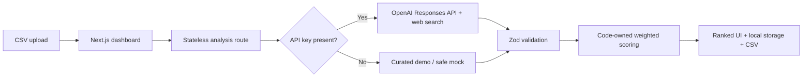

# Dutch SME Acquisition Scout — Interactive Prototype

[](https://nextjs.org/)
[](https://www.typescriptlang.org/)
[](https://github.com/Marincho09/dutch-sme-acquisition-scout-prototype/actions/workflows/ci.yml)
[](https://dutch-sme-acquisition-scout-prototype.vercel.app/)
[](LICENSE)

A polished interactive prototype for researching, enriching, and ranking Dutch SME acquisition targets. Upload a two-column CSV and receive evidence-linked acquisition profiles, transparent scorecards, a ranked target library, and personalized founder outreach.

> Portfolio status: the full application runs locally and in Vercel-compatible environments. It includes a curated ten-company demo, so reviewers can explore the workflow without an API key.

## Live prototype

**[Open the Dutch SME Acquisition Scout](https://dutch-sme-acquisition-scout-prototype.vercel.app/)** and select **Use 10-company sample** to explore the complete research, ranking, scorecard, profile, outreach, and export workflow without installing anything.

## Product highlights

- Drag-and-drop CSV ingestion with row-level validation and clear error states.
- Live public-web research through the OpenAI Responses API when configured.
- A no-key demo using ten real Dutch companies and curated official sources.
- Structured Zod validation for incoming companies and model output.
- Five-factor, code-calculated acquisition scorecard with visible evidence.
- Ranked target library, expandable snapshots, search, and CSV export.
- Scorecard methodology, outreach library, and workspace settings panels.
- Detailed acquisition profile route for every completed target.
- Strict `Information unavailable` treatment for unsupported facts.

## How it works



The model supplies structured research and criterion evidence. Application code calculates the final weighted total, so ranking logic remains deterministic and testable. See [the architecture notes](docs/ARCHITECTURE.md) for the main design decisions.

## Quick start

Requirements: Node.js 22+ and pnpm 11+.

```bash
pnpm install
cp .env.example .env.local
pnpm dev
```

Open [http://localhost:3000](http://localhost:3000), select **Use 10-company sample**, then choose **Research & rank targets**.

### Windows without a global pnpm command

If dependencies are already installed, run:

```bat
node_modules\.bin\next.cmd dev
```

Keep that terminal open while using the application. Alternatively, install pnpm with `corepack enable` followed by `corepack prepare pnpm@11.7.0 --activate`.

## CSV input

The file must contain these required columns:

```csv
company_name,website_url
Example Company,https://example.com
```

A ready-to-use file with ten real targets is included at `public/sample-companies.csv`. Inclusion is for sourcing research only and does not imply that a company is for sale.

## Environment variables

| Variable | Required | Purpose |
| --- | --- | --- |
| `OPENAI_API_KEY` | No | Enables live public-web research and structured assessments. |
| `OPENAI_MODEL` | No | Overrides the configured model; defaults to `gpt-5.4-mini`. |

Copy `.env.example` to `.env.local`. Keep the key server-side and never prefix it with `NEXT_PUBLIC_`.

## Scorecard

| Criterion | Weight |
| --- | ---: |
| Business-model attractiveness | 25% |
| Recurring or repeat revenue | 20% |
| Fragmentation and competitive defensibility | 20% |
| Operational improvement potential | 15% |
| Long-term owner-operator suitability | 20% |

Each criterion is scored from 1–5. The weighted total is calculated in `lib/scoring.ts`, not generated by the model.

## Evidence and safety policy

The copilot does not invent financial figures, employee counts, ownership details, or succession claims. Missing support is shown as `Information unavailable`, confidence is explicit, and public source URLs remain visible for review. The output is a sourcing aid—not investment, legal, or financial advice.

## Quality checks

```bash
pnpm typecheck
pnpm test
pnpm build
```

`pnpm check` runs the complete sequence. GitHub Actions repeats it for every push and pull request.

## Deployment

The architecture is Vercel-compatible: deploy the repository, add `OPENAI_API_KEY` and optionally `OPENAI_MODEL` as server-side environment variables, then redeploy. No database is required for the MVP; completed assessments are retained in the current browser's local storage.

## Current MVP boundaries

- Companies are processed sequentially to make progress and individual failures easy to understand.
- There is no authentication, shared workspace, database, CRM sync, or background job queue.
- Arbitrary uploads require an API key for live enrichment; otherwise they receive a conservative mock assessment.
- Research quality depends on the public information available for each company.

## Roadmap

- Persistent team workspaces and saved pipelines.
- Configurable scoring weights and investment theses.
- Batch jobs with resumability, rate-limit handling, and audit logs.
- CRM export and founder-outreach tracking.
- Human review and approval before outreach.

## License

MIT © 2026 Marin Marinov. See [LICENSE](LICENSE).
